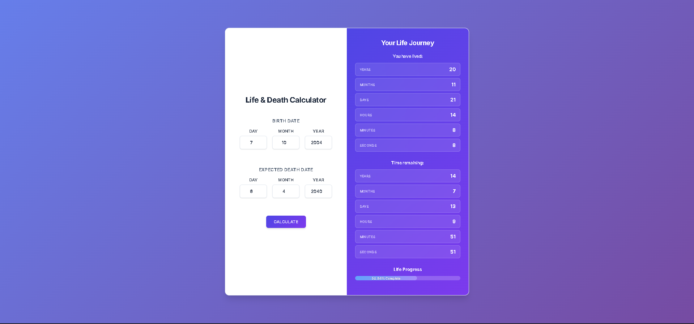

# 🌸 Birth & Death Calculator ✨

A beautiful Japanese themed web calculator that tracks your life journey by calculating time lived and time remaining based on your birth and expected death dates.

## 🎨 Features

- **🌸 Anime-Inspired Design**: Beautiful Japanese aesthetic with vibrant gradients
- **💎 Glassmorphism Effects**: Modern glass containers with backdrop blur
- **🔄 Card Flip Animation**: Smooth 3D transition between input and results
- **📱 Responsive Design**: Works perfectly on all devices
- **⏰ Live Counters**: Real-time countdown of remaining time
- **🎯 Smart Validation**: Date validation with error messages

## � Screenshot



## �🚀 Demo

**Live Demo**: [Birth & Death Calculator](https://rahul-meena01.github.io/birth-and-death-calculator/)

## 🛠️ Technologies

- **HTML5** - Semantic structure
- **CSS3** - Advanced animations and glassmorphism
- **JavaScript** - Date calculations and real-time updates
- **Google Fonts** - Beautiful typography

## 📦 Quick Start

1. **Clone the repository**:

   ```bash
   git clone https://github.com/Rahul-Meena01/birth-and-death-calculator.git
   cd birth-and-death-calculator
   ```

2. **Open in browser**:
   - Simply open `index.html` in your web browser
   - Or use a local server: `python -m http.server 8000`

## 🎮 How to Use

1. Enter your birth date (day, month, year)
2. Enter your expected death date
3. Click the "Calculate" button
4. Watch the card flip to reveal your life statistics
5. View real-time countdown of remaining time

## 🤝 Contributing

Contributions welcome! Please feel free to submit a Pull Request.

## 📄 License

This project is open source and available under the MIT License.

## 👨‍💻 Author

**Rahul Meena** - [@Rahul-Meena01](https://github.com/Rahul-Meena01)

---

**Made with 💖 for you!** 🌸
