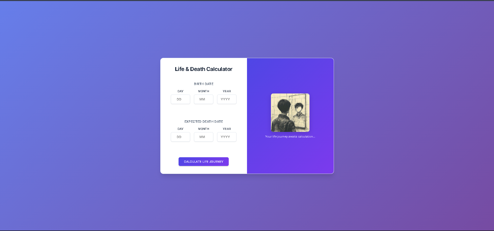

# 🌸 Life & Death Calculator ✨

A beautiful and professional web calculator that tracks your life journey by calculating time lived and time remaining based on your birth and expected death dates.

## 🎨 Features

- **� Professional Design**: Clean, modern interface with Inter font typography
- **� Perfect Responsive**: Optimized for all devices - desktop, tablet, and smartphone
- **⚡ Real-time Updates**: Live countdown with second-by-second precision
- **� Smart Validation**: Comprehensive date validation with helpful error messages
- **� Progress Visualization**: Beautiful progress bar showing life completion percentage
- **🖼️ Visual Elements**: Elegant image integration with smooth hover effects
- **♿ Accessibility**: Clean, accessible design with proper contrast and typography

## 📸 Screenshots

### Desktop View


### Mobile Responsive View


## �🚀 Demo

**Live Demo**: [Birth & Death Calculator](https://rahul-meena01.github.io/birth-and-death-calculator/)

## 🛠️ Technologies

- **HTML5** - Semantic structure and accessibility
- **CSS3** - Modern styling with flexbox, gradients, and animations
- **JavaScript ES6+** - Advanced date calculations and real-time updates
- **Google Fonts (Inter)** - Professional typography
- **Responsive Design** - Mobile-first approach with perfect smartphone optimization

## 📁 Project Structure

```
birth-and-death-calculator/
├── index.html          # Main HTML structure
├── styles.css          # Complete CSS styling and responsive design
├── script.js           # JavaScript functionality and calculations
├── README.md           # Project documentation
├── screenshot.png      # Desktop screenshot
├── screenshot2.png     # Mobile screenshot
└── .gitignore          # Git ignore rules
```

## 📦 Quick Start

1. **Clone the repository**:

   ```bash
   git clone https://github.com/Rahul-Meena01/birth-and-death-calculator.git
   cd birth-and-death-calculator
   ```

2. **Open in browser**:
   - Simply open `index.html` in your web browser
   - Or use a local server: `python -m http.server 8000`
   - All files (HTML, CSS, JS) are properly linked and ready to use

## 🎮 How to Use

1. **Enter your birth date** (day, month, year)
2. **Enter your expected death date** (day, month, year)
3. **Click "Calculate Life Journey"** button
4. **View your life statistics** with real-time updates
5. **Watch the live countdown** of remaining time with second precision

## 📱 Mobile Optimization

- **Perfect responsive design** for all smartphone sizes
- **Touch-friendly inputs** with proper sizing
- **Optimized layouts** for portrait and landscape orientations
- **Fast loading** with separated CSS and JS files
- **Smooth animations** optimized for mobile performance

## 🤝 Contributing

Contributions welcome! Please feel free to submit a Pull Request.

## 📄 License

This project is open source and available under the MIT License.

## 👨‍💻 Author

**Rahul Meena** - [@Rahul-Meena01](https://github.com/Rahul-Meena01)

---

**Made with 💖 for you!** 🌸
